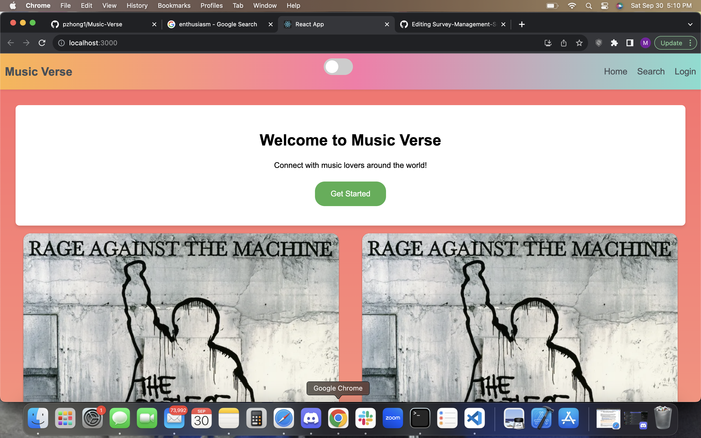

# Music Verse

## Links

The URL of the deployed application: 

[https://pzhong1.github.io/BA-travel-/](https://github.com/pzhong1/Music-Verse.git)

The URL of the GitHub repository:

https://music-verse2-57f59708a605.herokuapp.com/

## Description

    Music Verse is a cutting-edge music-centric platform designed for enthusiasts to explore, critique, and share their passion for melodies and harmonies. Within Music       Verse, users can delve into new tracks, offer comprehensive reviews, evaluate compositions, and craft posts that foster dynamic interactions within the community.

## Table of Contents

* [Description](#description)
* [Deployed-URL](#deployed-url)
* [Screenshots](#screenshots)
* [Features](#features)
* [Technologies-Used](#technologies-used)
* [Collaborators](#collaborators)

## Screenshots

## Features

* Search for music
* Write reviews
* Rate music
* Create posts
* Interact with posts: like & comment
* Light/dark mode
* Login/sign up accounts

## Technologies Used

* React
* GraphQL, Node, & Express
* MongoDB & Mongoose ODM
* Heroku
* JWT
* Spotify API

## Collaborators

* <a href="https://github.com/JacobDFlores">Jacob Flores</a>
* <a href="https://github.com/BuggyFord">Tyler Johnson</a>
* <a href="https://github.com/EAnthonycarranza">Anthony Carranza</a>
* <a href="https://github.com/pzhong1">Puze Zhong</a>
* <a href="https://github.com/Mardyyy"> Martin Apopot</a>

